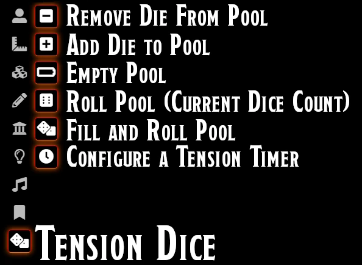
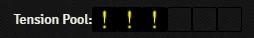
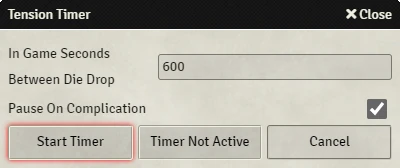
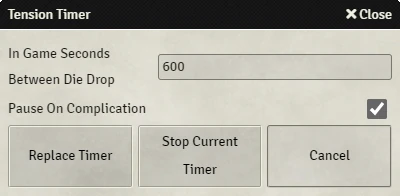

# Tension Pool

Tension Pool is a Foundry Implementation and Evolution of the Angry GM's idea of [Time Pools/Tension Pools](https://theangrygm.com/making-things-complicated/).

## Install

Available on the Forge and via the module directory within Foundry.

Alternatively install via the manifest url: https://github.com/SDoehren/tension-pool/releases/latest/download/module.json

## Instructions

Tension Pool can be controlled from scene controls

Alternatively, click the pool to add a die

Or use [chat commands](https://github.com/SDoehren/tension-pool#chat-commands)

### Tension Timer

Tension Timer requires [Simple Calendar by vigoren](https://github.com/vigoren/foundryvtt-simple-calendar#installing-the-module); Simple Calendar is not a dependency so needs to be installed and activated separately.  
Setting a Tension Timer will lead to a die being dropped in regular intervals based on the in game clock.

To set a timer open the timer configure using the scene controls.  
Pick the interval you wish to use in _in game_ seconds (default: 600).  
Hit start timer and the Tension Timer will automatically drop dice as appropriate.
The simple calendar must be running for dice to drop.

To replace or stop a timer, open the timer configure using the scene controls and choose the appropriate option.

## Chat Commands

- /TPadddie - Adds a Die to the Pool
- /TPremovedie - Remove Die from Pool
- /TPemptypool - Empty the Pool (no roll)
- /TProllpool - Roll the Dice Pool
- /TProllfullpool - Fill and Roll the Dice Pool

## Hook Calls and API

Hook Calls and API are available [here](api.md)

## Complication Likelihood

|Pool Size|**d4**|**d6**|**d8**|**d10**|**d12**|**d20**|**d100**
:-----:|:-----:|:-----:|:-----:|:-----:|:-----:|:-----:|:-----:
1|25.0%|16.7%|12.5%|10.0%|8.3%|5.0%|1.0%
2|43.8%|30.6%|23.4%|19.0%|16.0%|9.8%|2.0%
3|57.8%|42.1%|33.0%|27.1%|23.0%|14.3%|3.0%
4|68.4%|51.8%|41.4%|34.4%|29.4%|18.5%|3.9%
5|76.3%|59.8%|48.7%|41.0%|35.3%|22.6%|4.9%
6|82.2%|**66.5%**|55.1%|46.9%|40.7%|26.5%|5.9%
7|86.7%|72.1%|60.7%|52.2%|45.6%|30.2%|6.8%
8|90.0%|76.7%|65.6%|57.0%|50.1%|33.7%|7.7%
9|92.5%|80.6%|69.9%|61.3%|54.3%|37.0%|8.6%
10|94.4%|83.8%|73.7%|65.1%|58.1%|40.1%|9.6%
11|95.8%|86.5%|77.0%|68.6%|61.6%|43.1%|10.5%
12|96.8%|88.8%|79.9%|71.8%|64.8%|46.0%|11.4%
13|97.6%|90.7%|82.4%|74.6%|67.7%|48.7%|12.2%
14|98.2%|92.2%|84.6%|77.1%|70.4%|51.2%|13.1%
15|98.7%|93.5%|86.5%|79.4%|72.9%|53.7%|14.0%
16|99.0%|94.6%|88.2%|81.5%|75.1%|56.0%|14.9%
17|99.2%|95.5%|89.7%|83.3%|77.2%|58.2%|15.7%
18|99.4%|96.2%|91.0%|85.0%|79.1%|60.3%|16.5%
19|99.6%|96.9%|92.1%|86.5%|80.9%|62.3%|17.4%
20|99.7%|97.4%|93.1%|87.8%|82.5%|64.2%|18.2%

## Change log

[Change log](Changelog.md)

#### 0052 - Tension Timer

- Tension Timer added (requires [Simple Calendar by vigoren](https://github.com/vigoren/foundryvtt-simple-calendar#installing-the-module))
- Option to pause the game while the pool is being rolled added. 

#### 0051 - minor bug fix

- removed the ability of players to trigger adddie event

#### 0.0.50

- Protection against overfilling the pool has been added.

### Licence

 This work is licensed under a <a rel="license" href="http://creativecommons.org/licenses/by-nc-sa/4.0/">Creative Commons Attribution-NonCommercial-ShareAlike 4.0 International License</a>.